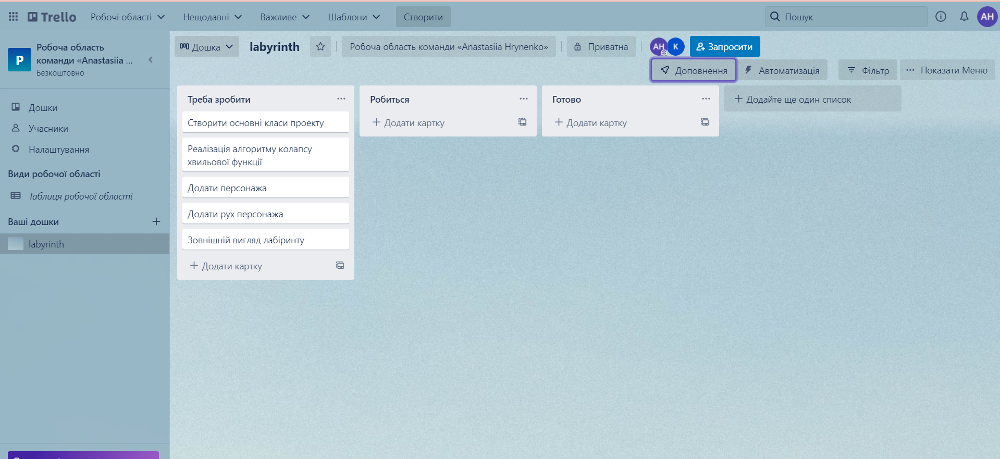
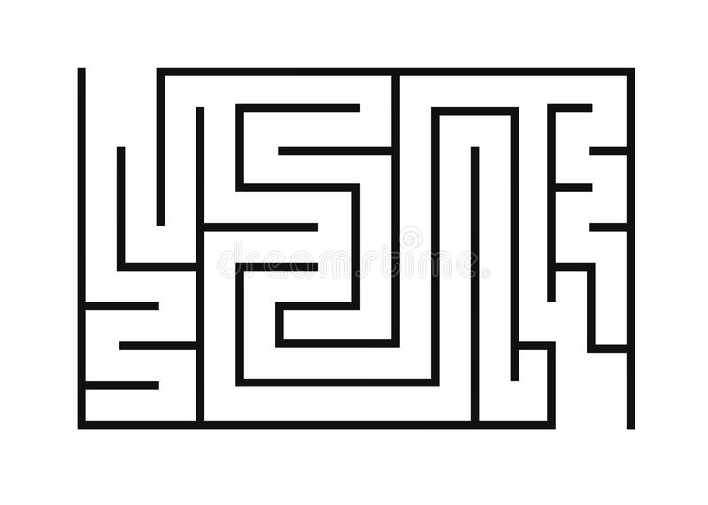

# Team and project
## Team code
> Г10

## Team members list 
1. > Амброзяк Христина, ІА-93
2. > Гриненко Анастасія, ІА-93

## Unity version
> Версія Unity (2020.3.28f1)

 

# Lab
## About team task management
### Trello

## Chosen games analysis
### Назва гри - Лабіринт

### Mета геймплею  
Cтворити гру - Лабіринт, ціль якої знайти вихід з динамічно побудованого лабіринту.

### Логічні компоненти
1. > Рух персонажа  
Рух персонажа по лабіринту відбувається за допомогою клавіш стрілок на клавіатурі.
2. > Генерація лабіринту  
 Генерація карти (самого лабіринту) має відбуватись автоматично за допомогою певного алгоритму. Може бути виконана за допомогою алгоритму колапсу хвильової функції. Він дозволяє генерувати дані, схожі на вихідні процедурно.
3. > Накладання туману на лабіринт  
Туман має вкривати весь лабіринт, окрім персонажа. По ходу руху персонажа туман розсіюється поруч з ним.
4. > Проектування зовнішнього вигляду лабіринту  
Наближений, спрощений вигляд лабіринту у грі:

5. > Проектування зовнішнього вигляду персонажу  
Персонаж має виділятись на фоні лабіринту.